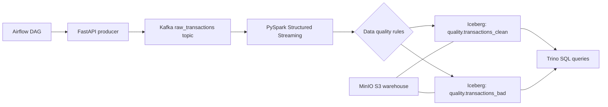

# End-to-End Data Lakehouse Pipeline

An end-to-end data engineering portfolio project using Kafka, PySpark, Airflow, Apache Iceberg, MinIO, Trino, and Docker.

## Cost

This project is designed to run for free on a local machine.

It does not require:

- AWS
- Databricks
- Confluent Cloud
- Snowflake
- Managed Airflow
- Any paid database or storage service

Everything runs locally with Docker:

- MinIO replaces S3
- local Kafka replaces Confluent Cloud/MSK
- local Spark replaces Databricks/EMR
- local Trino replaces a managed query engine
- local Airflow replaces managed orchestration

You only need Docker Desktop and enough laptop resources.

## Goal

Build a reproducible lakehouse pipeline:

```text
API -> Kafka -> Spark -> Iceberg Tables on MinIO -> Trino Queries
```

## Architecture



## Tech Stack

- Kafka for event streaming
- FastAPI for a simple source API
- PySpark Structured Streaming for ingestion and validation
- Apache Iceberg for lakehouse tables
- MinIO as local S3-compatible object storage
- Postgres as the local Iceberg REST catalog metadata database
- Trino for SQL analytics
- Airflow for orchestration
- Docker Compose for reproducibility

## Project Structure

```text
end-to-end-data-lakehouse-pipeline/
|-- api/
|-- airflow/dags/
|-- dashboard/
|-- docs/
|-- queries/
|-- seed/
|-- spark_jobs/
|-- src/quality/
|-- tests/
|-- trino/catalog/
|-- docker-compose.yml
|-- requirements-dev.txt
`-- README.md
```

## Run

Copy environment settings:

```powershell
Copy-Item .env.example .env
```

Start the core lakehouse services:

```powershell
docker compose up --build -d kafka minio minio-init iceberg-rest trino api spark
```

Publish one sample event:

```powershell
curl -X POST http://localhost:8000/transactions/sample
```

Publish one intentionally bad sample event:

```powershell
curl -X POST http://localhost:8000/transactions/sample-bad
```

Open service UIs:

- FastAPI docs: http://localhost:8000/docs
- MinIO console: http://localhost:9001
- Trino: http://localhost:8080
- Airflow: http://localhost:8088

Airflow is optional because it is heavier. Start it only when you are ready to test orchestration:

```powershell
docker compose --profile orchestration up -d airflow
```

The `transactions_backfill` DAG orchestrates the batch backfill: it launches the
Spark backfill job as a sibling container via `DockerOperator`, so Airflow drives
the same job you can also run by hand with `docker compose run --rm spark-backfill`.
This works because the Airflow service mounts the host Docker socket and the Spark
image is tagged `lakehouse-spark:local`. Build that image first (it is built when
you start the `spark` service), then open Airflow at http://localhost:8088 and
trigger the DAG.

Run a Trino query:

```powershell
docker exec -it lakehouse-trino trino
```

Then:

```sql
SELECT * FROM iceberg.quality.transactions_clean LIMIT 10;
```

Check rejected records:

```sql
SELECT transaction_id, email, amount, error_reason, processed_at
FROM iceberg.quality.transactions_bad
ORDER BY processed_at DESC
LIMIT 10;
```

## Idempotent Upserts

Clean records are written with an Iceberg `MERGE INTO` keyed on
`transaction_id`, not a blind append. Incoming rows are first deduplicated
(latest wins by `event_ts`, then `kafka_timestamp`), then merged: an existing
transaction is updated in place and a new one is inserted. Re-delivered Kafka
messages, overlapping backfills, and replayed batches therefore never create
duplicate rows. Bad records are appended instead, since they form an audit log
of rejections and may carry a null `transaction_id`.

Verify there are no duplicates (`duplicate_rows` should be `0`):

```sql
SELECT count(*) - count(DISTINCT transaction_id) AS duplicate_rows
FROM iceberg.quality.transactions_clean;
```

## Batch Backfill

Streaming and batch ingestion share a single code path
(`spark_jobs/lakehouse_common.py`), so historical data is validated and routed
exactly like live events. Replay a file of historical transactions into the same
Iceberg tables with a one-shot job (the stack must already be running):

```powershell
docker compose run --rm spark-backfill
```

It reads newline-delimited JSON from `seed/backfill_sample.jsonl` (override with
the `BACKFILL_PATH` environment variable), applies the data quality rules, and
appends clean and bad rows to the partitioned tables. Verify in Trino:

```sql
SELECT count(*) FROM iceberg.quality.transactions_clean WHERE transaction_id LIKE 'bf-%';
```

## Data Quality Rules

A transaction is rejected when:

- `transaction_id` is missing
- `user_id` is missing
- `email` is missing or invalid
- `amount` is missing or less than or equal to zero
- `event_time` is missing

Bad records are written to:

```text
iceberg.quality.transactions_bad
```

Clean records are written to:

```text
iceberg.quality.transactions_clean
```

The Iceberg REST catalog uses local Postgres instead of embedded SQLite so Spark writes and Trino queries can run more reliably during development.

## Tests

Unit tests (data quality rules) run with no infrastructure:

```powershell
pip install -r requirements-dev.txt
python -m pytest tests
```

Integration tests publish events through the API and assert they flow through
Kafka -> Spark -> Iceberg and are queryable in Trino (clean routing, bad
routing, and MERGE idempotency). They are skipped unless the stack is running
and `RUN_INTEGRATION_TESTS=1` is set:

```powershell
docker compose up --build -d kafka minio minio-init iceberg-postgres iceberg-rest trino api spark
$env:RUN_INTEGRATION_TESTS = "1"
python -m pytest tests -m integration
```

## Dashboard

A Streamlit dashboard reads the curated tables straight from Trino (headline
metrics, status mix, rejection reasons, and daily volume):

```powershell
docker compose --profile tools up --build -d dashboard
```

Then open http://localhost:8501.

## Helper Scripts

```powershell
.\scripts\start_core.ps1
.\scripts\publish_sample.ps1
.\scripts\start_airflow.ps1
.\scripts\stop_all.ps1
```

## Partitioning

Iceberg tables are partitioned to enable partition pruning on time-range queries:

- `transactions_clean` is partitioned by `days(event_ts)` — the parsed event
  timestamp — so analytical queries that filter on an event-date range only scan
  the relevant day partitions.
- `transactions_bad` is partitioned by `days(processed_at)` — the ingestion
  timestamp — because a rejected record's `event_time` may itself be missing or
  invalid (`missing_event_time` is one of the reject rules), which would otherwise
  collapse bad rows into a single null partition.

Example partition-pruned query:

```sql
SELECT count(*)
FROM iceberg.quality.transactions_clean
WHERE event_ts >= TIMESTAMP '2026-06-01 00:00:00'
  AND event_ts <  TIMESTAMP '2026-06-02 00:00:00';
```

## Roadmap

- ~~Add batch backfill job~~ (shipped)
- ~~Add incremental merge/upsert logic~~ (shipped)
- ~~Add partitioning strategy by event date~~ (shipped)
- ~~Add dashboard with Superset or Streamlit~~ (shipped, Streamlit)
- ~~Add integration tests for Docker Compose~~ (shipped)
