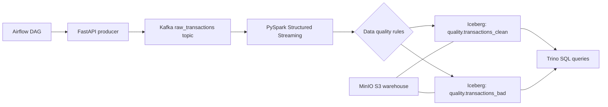

# End-to-End Data Lakehouse Pipeline

An end-to-end data engineering portfolio project using Kafka, PySpark, Airflow, Apache Iceberg, MinIO, Trino, and Docker.

## Cost

This project is designed to run for free on a local machine.

It does not require:

- AWS
- Databricks
- Confluent Cloud
- Snowflake
- Managed Airflow
- Any paid database or storage service

Everything runs locally with Docker:

- MinIO replaces S3
- local Kafka replaces Confluent Cloud/MSK
- local Spark replaces Databricks/EMR
- local Trino replaces a managed query engine
- local Airflow replaces managed orchestration

You only need Docker Desktop and enough laptop resources.

## Goal

Build a reproducible lakehouse pipeline:

```text
API -> Kafka -> Spark -> Iceberg Tables on MinIO -> Trino Queries
```

## Architecture



## Tech Stack

- Kafka for event streaming
- FastAPI for a simple source API
- PySpark Structured Streaming for ingestion and validation
- Apache Iceberg for lakehouse tables
- MinIO as local S3-compatible object storage
- Trino for SQL analytics
- Airflow for orchestration
- Docker Compose for reproducibility

## Project Structure

```text
end-to-end-data-lakehouse-pipeline/
|-- api/
|-- airflow/dags/
|-- configs/
|-- docs/
|-- queries/
|-- spark_jobs/
|-- src/quality/
|-- tests/
|-- trino/catalog/
|-- docker-compose.yml
|-- requirements-dev.txt
`-- README.md
```

## Run

Copy environment settings:

```powershell
Copy-Item .env.example .env
```

Start the core lakehouse services:

```powershell
docker compose up --build -d kafka minio minio-init iceberg-rest trino api spark
```

Publish one sample event:

```powershell
curl -X POST http://localhost:8000/transactions/sample
```

Open service UIs:

- FastAPI docs: http://localhost:8000/docs
- MinIO console: http://localhost:9001
- Trino: http://localhost:8080
- Airflow: http://localhost:8088

Airflow is optional because it is heavier. Start it only when you are ready to test orchestration:

```powershell
docker compose --profile orchestration up -d airflow
```

Run a Trino query:

```powershell
docker exec -it lakehouse-trino trino
```

Then:

```sql
SELECT * FROM iceberg.quality.transactions_clean LIMIT 10;
```

## Data Quality Rules

A transaction is rejected when:

- `transaction_id` is missing
- `user_id` is missing
- `email` is missing or invalid
- `amount` is missing or less than or equal to zero
- `event_time` is missing

Bad records are written to:

```text
iceberg.quality.transactions_bad
```

Clean records are written to:

```text
iceberg.quality.transactions_clean
```

## Tests

```powershell
pip install -r requirements-dev.txt
python -m pytest tests
```

## Helper Scripts

```powershell
.\scripts\start_core.ps1
.\scripts\publish_sample.ps1
.\scripts\start_airflow.ps1
.\scripts\stop_all.ps1
```

## Roadmap

- Add batch backfill job
- Add incremental merge/upsert logic
- Add partitioning strategy by event date
- Add dashboard with Superset or Streamlit
- Add integration tests for Docker Compose
